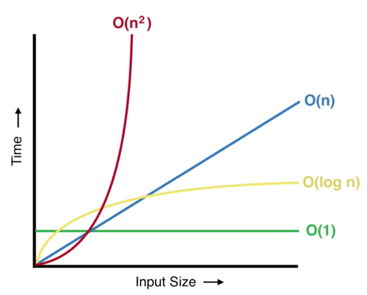

#### Projekt ASD

Projekt polega na porównaniu czasu działania algorytmów sortujących:
1. Heap sort
2. Quick sort
3. Merge sort
4. Insertion sort

Czas wykonania algorytmów mierzony jest w sekundach. Algorytmy wykonują się na tych samych tablicach posiadających losowe elementy o typie integer z zakresu liczb 0-99999. Rozmiar wszystkich tablic to 500 000 elementów. W projekcie wykorzystano język Python do napisania funkcji algorytmów sortujących.

##### Opis zachowania algorytmów
Heap sort - w najlepszym, przeciętnym i najgorszym przypadku złożoności czasowej algorytm działa tak samo, niezależnie od rozkładu danych w tablicy, czyli wykonuje się w czasie nlogn.

Quicksort - algorytm ten działa na zasadzie “dziel i zwyciężaj” z relacją rekurencji:
T(n) = T(k) + T(n-k-1) + cn
W najlepszym i przeciętnym przypadku złożoności czasowej, algorytm wykonuje się w czasie O(nlogn), w najgorszym przypadku złożoności czasowej, czyli w sytuacji, w której tablica posiada dane posortowane lub odwrotnie posortowane, algorytm dzieli tablicę na dwie mniejsze:
T(n) = T(0) - T(n-1) + cn
Co daje czas wykonania algorytmu:
T(n) = O(n^2)

Merge sort - w najlepszym, przeciętnym i najgorszym przypadku złożoności czasowej algorytm działa tak samo, niezależnie od rozkładu danych w tablicy, czyli wykonuje się w czasie nlogn.

Insertion sort - w najlepszym przypadku złożoności czasowej, czyli w przypadku, gdy tablica posiada posortowane dane, algorytm wykonuje się w czasie n. W przypadku gdy tablica posiada odwrotnie posortowane mówimy o najgorszym przypadku złożoności czasowej, która wynosi n^2, również dla przeciętnego przypadku złożoności czasowej.

Funkcje złożoności czasowej dla wymienionych przypadków sortowania przedstawiono na wykresie:

Czas wykonania poszczególnych algorytmów podany w sekundach dla tablic z losowymi wartościami liczbowymi, tablic posortowanych i odwrotnie posortowanych przedstawiono w tabeli:

|                | Losowe liczby | Uporzadkowane | Nieuporzadkowane |
| -------------  |--------------:| -------------:|-----------------:|
| Heap sort      | 12,92         | 9,32          | 9,1              |
| Quicksort      | >30           | >30           | >30              |
| Merge sort     | 6,53          | 5,1           | 5,14		    |
| Insertion sort | 0,35          | 0,22          | 0,14		    |

##### Interpretacja wyników
Najszybszym algorytmem okazał się algorytm sortowania przez wstawianie (insertion sort), który wykonał się bardzo szybko niezależnie od rozkładu liczb w tablicy pod względem wielkości. 

Najwolniejszym algorytmem był quicksort, który nie poradził sobie z tak dużym zestawem danych. Ze względu na zbyt dużą ilość rekursywnych wywołań funkcji, wbudowany mechanizm Pythona nie pozwolił na wykonanie zbyt wielu rekursywnych wywołań funkcji, aby zapobiec przepełnieniu stosu pamięci. Z tego względu przyjęto, że algorytm quicksort we wszystkich przypadkach wykonał się w czasie powyżej 30 sekund. W rzeczywistości doszło do tzw. degradacji algorytmu przy tak dużej ilości danych wejściowych. Jest to spodziewany rezultat ze względu na eksponencjalny wzrost wywołań rekurencyjnych funkcji wraz ze wzrostem rozmiaru tablicy.

Algorytmy o złożoności czasowej nlogn niezależnej od rozkładu danych, czyli heap sort i merge sort wykonywały się nieco dłużej dla tablicy losowych liczb. Dzieje się tak ze względu na to, że algorytmy te dzielą dane wsadowe na region posortowany i nieposortowany, co powoduje, że z każdą kolejną ich iteracją dane pozostałe do posortowania kurczą się. W przypadku tablic posortowanych lub odwrotnie posortowanych, następuje mniejsza ilość operacji podczas kolejnych iteracji sortowania.

